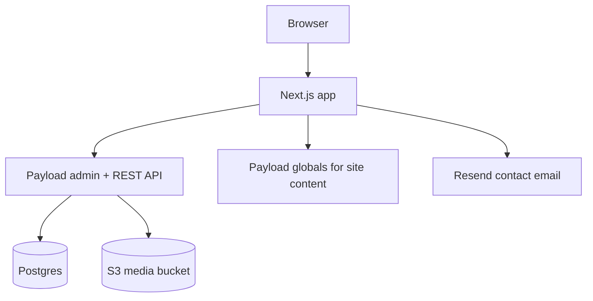

# Lumen Yoga

Lumen Yoga is a Next.js 16 website that is being migrated from hardcoded marketing content to Payload CMS.

## Current stack

- Next.js App Router
- React 19
- Payload CMS 3
- PostgreSQL
- S3 media storage
- Tailwind CSS
- Resend contact form
- PostHog + GTM

## Architecture



## Content model

Payload currently manages:

- `site-settings` global
- `header` global
- `footer` global
- `home` global
- `media` collection
- `users` collection

## Local development

1. copy envs
2. start Postgres
3. run the app
4. seed the current content into Payload

```bash
cp .env.example .env.local
cp .env.production.example .env.production # optional reference for deployment

docker compose up -d db
bun install
bun run payload:generate-importmap
bun run payload:generate-types
bun run dev
```

In another shell, seed the current website content:

```bash
bun run seed:lumen
```

Then open:

- site: `http://localhost:3000`
- admin: `http://localhost:3000/admin`

## Production-style local run

```bash
docker compose up -d --build
```

This exposes:

- app on `127.0.0.1:3030`
- postgres on `127.0.0.1:5440`

## Required environment variables

Core:

- `DATABASE_URL`
- `PAYLOAD_SECRET`
- `RESEND_API_KEY`
- `POSTGRES_DB`
- `POSTGRES_USER`
- `POSTGRES_PASSWORD`

Public frontend:

- `NEXT_PUBLIC_GOOGLE_FEATURABLE_WIDGET`
- `NEXT_PUBLIC_POSTHOG_KEY`
- `NEXT_PUBLIC_POSTHOG_HOST`

S3 media:

- `S3_BUCKET`
- `S3_REGION`
- `S3_ACCESS_KEY_ID`
- `S3_SECRET_ACCESS_KEY`
- `S3_SESSION_TOKEN` (when using temporary AWS credentials)

## Deployment target

Preview deploy target is `mann-dev` with:

- Docker Compose for app + Postgres
- system Caddy reverse proxy for HTTPS
- preview hostname `lumen.manndigital.nl`

Caddy site snippet:

- `deploy/Caddyfile.lumen.manndigital.nl`

## Server workflow on `mann-dev`

Canonical server repo:

- `~/projects/lumen-yoga`

Deploy from the server with:

```bash
./scripts/deploy.sh
```

Options:

- `./scripts/deploy.sh --seed`
- `./scripts/deploy.sh --no-pull`

The deploy script:

- pulls latest `master` with fast-forward only
- runs `docker compose up -d --build`
- prints container status
- prints recent app logs

## Useful commands

```bash
bun run dev
bun run build
bun run start
bun run lint
bun run payload:generate-importmap
bun run payload:generate-types
bun run payload:migrate
bun run seed:lumen
./scripts/deploy.sh
```
